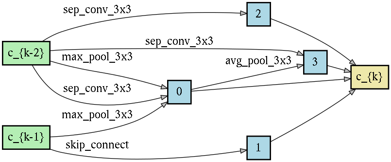
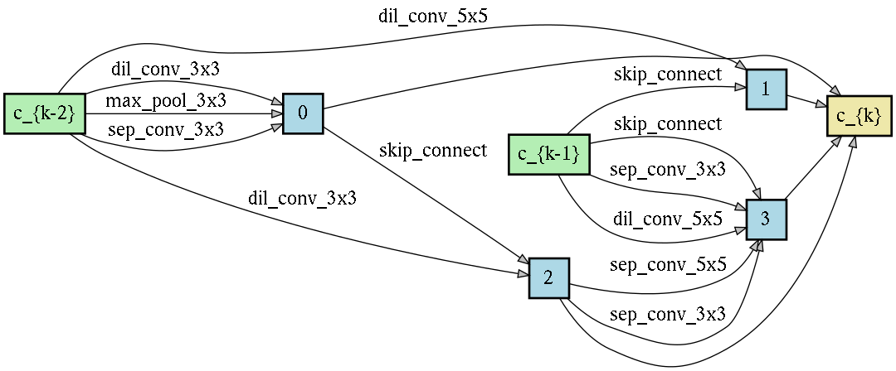

## One-Shot Neural Architecture Search Via Compressive Sensing: CoNAS

This is the code to reproduce the results from the paper. Implemented the code based on this [DARTs code](https://github.com/khanrc/pt.darts)

<figcaption>Normal Cell.</figcaption>

<figcaption>Reduce Cell.</figcaption>

### Setup

To setup the environment, use the requirements.txt file. 

### Codes

We include the codes for experiments conducted in the papers as following:

`search.py`: Cell searching algorithm for CoNAS on CIFAR-10.

`augment.py`: Final training file given the cell on CIFAR-10.

### Experiments

#### Searching cell on CIFAR-10

To searching the cell: `python search.py --seed 2`

#### Evaluating final architecture on CIFAR-10

We run final evaluation with 5 different seeds using seed 0, 1, 2, 3, 4.

Final Evaluation: `python augment.py --name "conas_cifar10_augment" --dataset "cifar10" --seed 0 --genotype "Genotype(normal=[[('max_pool_3x3', 0), ('sep_conv_3x3', 0), ('max_pool_3x3', 1)], [('skip_connect', 1)], [('sep_conv_3x3', 0)], [('sep_conv_3x3', 0), ('avg_pool_3x3', 2)]], normal_concat=range(2, 6), reduce=[[('max_pool_3x3', 0), ('sep_conv_3x3', 0), ('dil_conv_3x3', 0)], [('dil_conv_5x5', 0), ('skip_connect', 1)], [('dil_conv_3x3', 0), ('skip_connect', 2)], [('skip_connect', 1), ('sep_conv_3x3', 1), ('dil_conv_5x5', 1), ('sep_conv_3x3', 4), ('sep_conv_5x5', 4)]], reduce_concat=range(2, 6))"`
